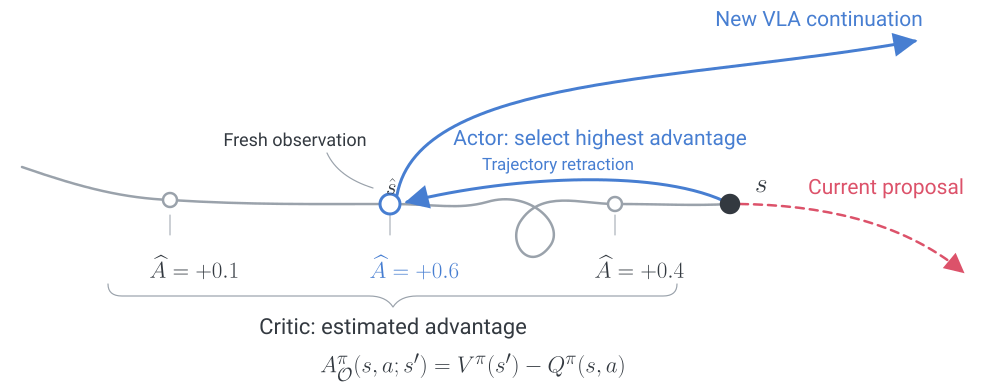

# ACRO: Actor–Critic Rollout Orchestration

[Project page](https://junhoo.me/acro) · [Paper](https://junhoo.me/acro/assets/paper/acro-preprint.pdf) · [LaTeX source](paper/)

Junhoo Lee², Seungyeon Kim¹, Baekseung Kim¹, Minkyu Kim¹, Suhyun Jeon¹, Jimyeong Kim¹, Nojun Kwak¹

¹ Seoul National University · ² KAIST

ACRO is a recovery layer for a fixed vision-language-action policy. A learned Critic estimates when to intervene and where to resume. Trajectory Retraction returns the robot to a useful configuration along its visited path, and the same VLA continues from a fresh observation.



Under the same physical execution budget, including return motion:

| Environment | Policy | Base success | ACRO success |
| --- | --- | ---: | ---: |
| SimplerEnv Bridge | GR00T N1.7 | 49.6% | 60.0% |
| RoboCasa | π₀.₅ | 60.7% | 68.0% |
| Franka Panda | π₀.₅ | 43.3% | 65.0% |

## Run the example

```sh
python -m pip install -e '.[dev,critic]'
python examples/mock_rollout.py
python -m pytest
```

The example runs the orchestration loop in a small CPU environment. Use the environment and policy interfaces in [CODE.md](CODE.md) to connect a VLA and robot or simulator. Learned checkpoints and benchmark integrations are supplied by the deployment.

## Repository

| Directory | Contents |
| --- | --- |
| `src/acro/` | Critic, calibrated intervention gate, retraction planner, and execution loop |
| `examples/` | A runnable orchestration example |
| `configs/` | Parameters for the paper’s execution settings |
| `tests/` | Core behavior, numerical checks, and physical budget accounting |
| `docs/` | Static project page, selected figures, recovery replay, and paper downloads |
| `paper/` | Preprint source and bibliography |

## Project page and paper

The project page is plain HTML, CSS, and JavaScript. Preview it with:

```sh
node scripts/preview.mjs
```

Open `http://127.0.0.1:4318`. GitHub Pages publishes the `docs/` directory through the included workflow.

Build the preprint and its source archive:

```sh
python scripts/build_paper.py
```

This requires [Tectonic](https://tectonic-typesetting.github.io/). Asset sources and page design references are documented in [docs/SOURCES.md](docs/SOURCES.md).
